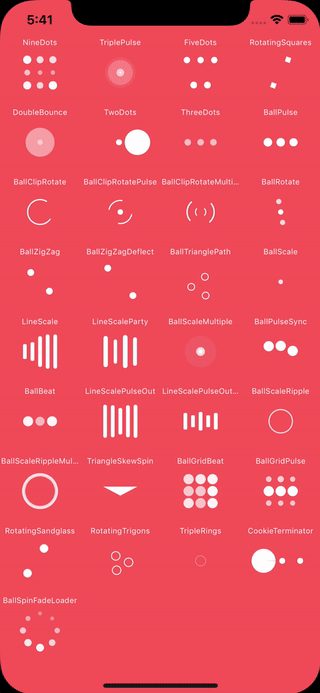

[](https://ci.appveyor.com/project/jzeferino/xamarin-ios-dgactivityindicatorview)   [](https://www.nuget.org/packages/Xamarin.iOS.DGActivityIndicatorView/)

Xamarin.iOS.DGActivityIndicatorView
===================

This is a Xamarin Android Binding for the [DGActivityIndicatorView](https://github.com/jzeferino/DGActivityIndicatorView).

DGActivityIndicatorView is a collection of nice loading animations for iOS.

## Demo


## Usage
(see the [sample](https://github.com/jzeferino/Xamarin.iOS.DGActivityIndicatorView/tree/master/src/Xamarin.iOS.DGActivityIndicatorViewBinding.Sample) project for a detailed working example)

### Step 1

Install NuGet [package](https://www.nuget.org/packages/Xamarin.iOS.DGActivityIndicatorView/).

### Step 2

Add the DGActivityIndicatorView to your layout:
```c#
var activityIndicatorView = new DGActivityIndicatorView(DGActivityIndicatorAnimationType.BallGridBeat, UIColor.White);
View.AddSubview(activityIndicatorView);
```

### Step 3

Show or hide the progress.
```c#
activityIndicatorView.StartAnimating();
```
or
```c#
activityIndicatorView.StopAnimating();   
```

## Indicators

As seen above in the **Demo**, the indicators are as follows:

 * `BallPulseIndicator`
 * `NineDots`
 * `TriplePulse`
 * `FiveDots`
 * `RotatingSquares`
 * `DoubleBounce`
 * `TwoDots`
 * `ThreeDots`
 * `BallPulse`
 * `BallClipRotate`
 * `BallClipRotatePulse`
 * `BallClipRotateMultiple`
 * `BallRotate`
 * `BallZigZag`
 * `BallZigZagDeflect`
 * `BallTrianglePath`
 * `BallScale`
 * `LineScale`
 * `LineScaleParty`
 * `BallScaleMultiple`
 * `BallPulseSync`
 * `BallBeat`
 * `LineScalePulseOut`
 * `LineScalePulseOutRapid`
 * `BallScaleRipple`
 * `BallScaleRippleMultiple`
 * `TriangleSkewSpin`
 * `BallGridBeat`
 * `BallGridPulse`
 * `RotatingSandglass`
 * `RotatingTrigons`
 * `TripleRings`
 * `CookieTerminator`
 * `BallSpinFadeLoader`
 
### License
[MIT Licence](LICENSE) 
